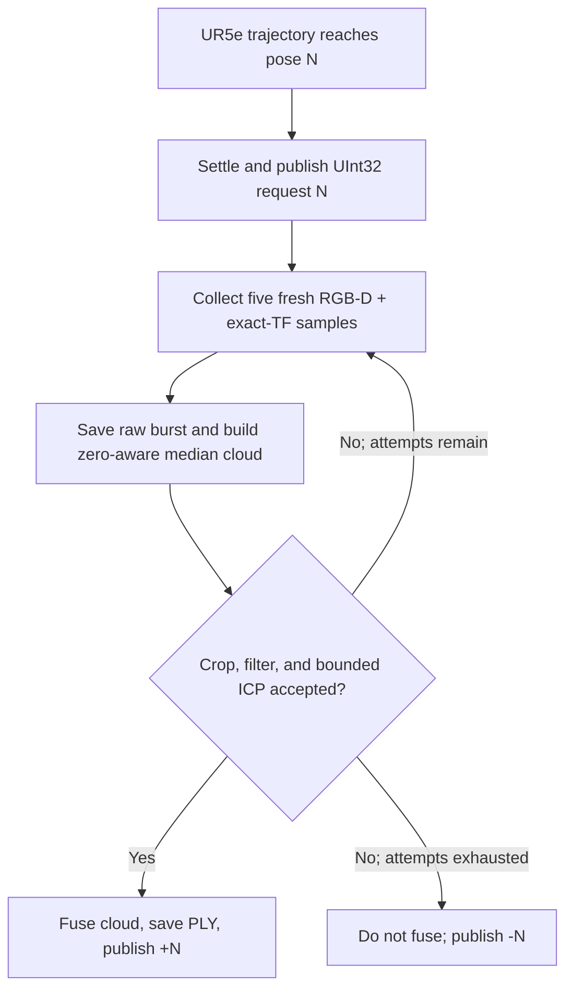

# Cornell Warthog UR5e RGB-D Tree Reconstruction

A ROS 2 Humble system for repeatable RGB-D acquisition and colored point-cloud
reconstruction of orchard trees using a Clearpath Warthog, a UR5e arm, and an
eye-in-hand RealSense camera.

## Quickstart

> **Physical-robot warning:** the commands below can move a UR5e. Keep the
> teach pendant and emergency stop within reach, use the lab-approved start
> pose and calibration, verify clearances, and keep an experienced operator
> present. Never begin with an unattended 32-step run.

The field-validated system spans two ROS 2 workspaces:

- this repository provides the `reconstruct` package, capture transaction,
  raw-data preservation, reconstruction, and offline analyses;
- Dawood Ahmed's `tree_scanning_ur5e` repository provides the validated UR5e
  bringup, `recorded_scan_trajectory.json`, and
  `arm_scan_motion/scanning_trajectory` replay executable.

Clone both into the paths used by the tested commands:

```bash
mkdir -p "$HOME/dev"

git clone <THIS_REPOSITORY_URL> \
  "$HOME/dev/cornell-warthog-sim"

git clone https://github.com/dahmedm/tree_scanning_ur5e.git \
  "$HOME/dev/dawood_tree_scanning_ur5e"
```

Before the final handoff tag, replace `<THIS_REPOSITORY_URL>` in this README and
record the exact branch and commit of the field-tested motion repository. The
latest upstream branch must not be assumed to contain the lab-tested capture
handshake changes.

Build:

```bash
source /opt/ros/humble/setup.bash

cd "$HOME/dev/cornell-warthog-sim"
rosdep install --from-paths src --ignore-src --recursive --yes
python3 -m pip install -r requirements.txt
colcon build --symlink-install

cd "$HOME/dev/dawood_tree_scanning_ur5e"
rosdep install --from-paths src --ignore-src --recursive --yes
colcon build --symlink-install
```

Use a unique `scan_id` in
[`src/reconstruct/config/params.yaml`](src/reconstruct/config/params.yaml)
before every run. Never reuse an earlier dataset directory.

For the Cornell lab network, prepare each terminal in this order:

```bash
source /opt/ros/humble/setup.bash
source "$HOME/dev/cornell-warthog-sim/install/setup.bash"
source "$HOME/dev/dawood_tree_scanning_ur5e/install/setup.bash"
export ROS_DOMAIN_ID=26
```

Terminal 1 — bring up the real UR5e and leave it running:

```bash
ros2 launch arm_scan_motion bringup.launch.py
```

Terminal 2 — start reconstruction with wall-clock time:

```bash
ros2 launch reconstruct scan_tree.launch.py \
  params_file:="$HOME/dev/cornell-warthog-sim/src/reconstruct/config/params.yaml" \
  use_sim_time:=false
```

Terminal 3 — verify the controller and capture interfaces:

```bash
ros2 control list_controllers
ros2 action list -t | grep follow_joint_trajectory
ros2 topic info /tree_scan/capture_request -v
ros2 topic info /tree_scan/capture_result -v
```

Begin with a supervised one-step test:

```bash
ros2 run arm_scan_motion scanning_trajectory --ros-args \
  --params-file "$HOME/dev/cornell-warthog-sim/src/reconstruct/config/params.yaml" \
  -p trajectory_input_path:="$HOME/dev/dawood_tree_scanning_ur5e/recorded_scan_trajectory.json" \
  -p max_steps:=1
```

After validating the interfaces and robot behavior, stop the test, assign a new
`scan_id`, restart the reconstructor, and run the complete validated sequence:

```bash
ros2 run arm_scan_motion scanning_trajectory --ros-args \
  --params-file "$HOME/dev/cornell-warthog-sim/src/reconstruct/config/params.yaml" \
  -p trajectory_input_path:="$HOME/dev/dawood_tree_scanning_ur5e/recorded_scan_trajectory.json" \
  -p max_steps:=32
```

Inspect the result:

```bash
python3 -m json.tool "$HOME/dev/tree_scans/<scan_id>/summary.json"
ls -lh "$HOME/dev/tree_scans/<scan_id>/global_point_cloud.ply"
```

The launch file starts only the reconstructor. It does **not** launch the robot
driver or motion executor, and it has no `execute_motion` argument.

## Project background and authorship

This work was completed in summer 2026 by **David Orjuela**, a University of
Central Florida undergraduate visiting Cornell University's AgRobotics Lab
through an NSF-funded REU collaboration with UCF.

The project began with a broader orchard-simulation objective and then narrowed
to a hardware-first need: collect real leafy-tree geometry that could eventually
be cleaned, meshed, simplified, and used as Gazebo assets.

David inherited Dawood Ahmed's tree-scanning, reconstruction, semantic
segmentation, and skeletonization work. This repository adapts and extends the
geometry-reconstruction portion. Major contributions include:

- migration of the required acquisition and reconstruction path to ROS 2
  Humble;
- synchronized aligned RGB-D processing and TF2 lookup at sensor time;
- numbered move–settle–capture transactions;
- fresh five-frame, zero-aware depth bursts;
- retry and rejection handling that never merges failed attempts;
- raw RGB, depth, intrinsics, TF, joint-state, and point-cloud preservation;
- configurable filtering and bounded coarse-to-fine point-to-plane ICP;
- repeatable offline filter and registration experiments;
- TF-only, incremental ICP, scan-order, and TF-anchored pose-graph baselines;
- six orchard datasets with machine-readable summaries.

The dormant-tree semantic segmentation and skeletonization stages were reviewed
but were not migrated into the final field system. They remain inherited work,
not a claimed deliverable of this repository.

See [`docs/provenance.md`](docs/provenance.md) and
[`docs/inherited_work.md`](docs/inherited_work.md) before redistributing code,
calibration, models, imagery, or reconstructed assets.

## Final status

### Delivered

- [x] ROS 2 Humble aligned RGB-D reconstruction node
- [x] TF2 placement at each sensor timestamp
- [x] Metric colored Open3D point clouds and binary PLY export
- [x] Automated replay of the validated 32-pose UR5e trajectory
- [x] Numbered capture request/result handshake
- [x] Five-frame zero-aware depth bursts
- [x] Up to three fresh attempts at one stationary pose
- [x] Rejected-attempt isolation and preservation
- [x] Per-run configuration and summary JSON
- [x] Per-capture RGB, raw depth, median depth, intrinsics, TF, joint state,
      metadata, and raw camera/base-frame PLY output
- [x] Complete supervised indoor 32-pose reconstruction
- [x] Controlled filter and voxel comparisons from identical saved captures
- [x] TF-only and incremental TF+ICP controls
- [x] Incremental-ICP order-sensitivity experiment
- [x] TF-anchored pose-graph experiment with held-out edges
- [x] Six orchard datasets across five physical trees
- [x] Four complete 32-pose orchard runs and two recoverable partial runs
- [x] Dated technical logbook and operating documentation

### Still open

- [ ] Pin the exact external motion-repository URL, branch, and commit
- [ ] Verify the final `CMakeLists.txt` and `package.xml` from a clean clone
- [ ] Formally validate the camera-to-tool eye-in-hand transform
- [ ] Add acquisition-completeness and sun-corruption metrics
- [ ] Replay outdoor data with TF-only, incremental ICP, and the pose graph
- [ ] Add fixed spatial crops and thin cross-section measurements
- [ ] Validate and record the proposed 42-pose/four-row trajectory
- [ ] Record a complete rosbag audit trail for a future acquisition
- [ ] Mesh, simplify, and package selected trees for Gazebo
- [ ] Resolve licenses and approval for public code/data release

## Results

The month ended with a repeatable field system.


### Orchard deployment

Six datasets were collected across five physical trees. The reconstructor
accepted **155 of 157 pose requests** and processed **161 total attempts**.
Four datasets completed all 32 planned poses; two retained useful partial
results.

| Dataset | Pose requests | Accepted | Rejected attempts | Mean ICP fitness | Mean ICP RMSE | Final points | Outcome |
| --- | ---: | ---: | ---: | ---: | ---: | ---: | --- |
| `outdoor_tree_1` | 32 | 32 | 0 | 0.861 | 3.64 mm | 599,999 | Complete; away from sun |
| `outdoor_tree_2` | 32 | 32 | 0 | 0.915 | 3.39 mm | 664,476 | Complete but visually unusable; camera faced sun |
| `outdoor_tree_3` | 32 | 32 | 0 | 0.836 | 3.78 mm | 1,031,782 | Complete; away from sun |
| `outdoor_tree_4` | 14 | 12 | 6 | 0.802 | 4.24 mm | 660,495 | Partial; two poses exhausted all retries |
| `outdoor_tree_5` | 15 | 15 | 0 | 0.810 | 4.13 mm | 737,169 | Partial motion/run interruption |
| `outdoor_tree_6` | 32 | 32 | 0 | 0.862 | 3.78 mm | 1,505,222 | Successful repeat of the final tree |

The first five runs used `max_depth_m: 2.5`; `outdoor_tree_6` used 3.5 m.
All used five-frame depth bursts, at least two valid observations per pixel,
three attempts per pose, 3 mm local/global voxels, statistical outlier removal,
TF initialization, coarse-to-fine ICP, raw preservation, and final PLY export.

`outdoor_tree_2` is an important negative result. It achieved the best ICP
fitness and RMSE while direct sunlight destroyed much of the useful RealSense
depth. Registration metrics describe alignment of surviving points; they do
not prove target completeness or botanical correctness.

### Controlled filter comparison

The same saved 32-capture indoor scan was replayed so every profile used
identical robot poses and RGB-D observations. The table below is the original
6 mm local/5 mm global voxel comparison.

| Profile | Accepted | Final points | Mean fitness | Mean RMSE |
| --- | ---: | ---: | ---: | ---: |
| No outlier removal | 32/32 | 59,065 | 0.9197 | 3.755 mm |
| Current radius | 32/32 | 58,401 | 0.9193 | 3.754 mm |
| Dawood radius | 32/32 | 50,903 | 0.9178 | 3.905 mm |
| Statistical | 32/32 | 59,367 | 0.9206 | 3.731 mm |

The statistical profile had the strongest numerical result by a small margin.
The current-radius profile appeared to preserve slightly more useful fine plant
structure. Dawood's radius profile was too aggressive, and the unfiltered
result retained too much noise. The final field configuration used statistical
filtering at 3 mm local/global voxel size.

### Registration analysis

Good local ICP metrics did not imply a drift-free global reconstruction. In
the reported 4 mm local/global registration experiment, chronological
incremental ICP accepted all 32 captures, with approximately 0.927 mean fitness
and 3.32 mm mean RMSE, but the corrected poses increasingly departed from TF.

| Metric | Incremental TF + ICP | Nominal TF-anchored pose graph |
| --- | ---: | ---: |
| Mean translation deviation from TF | 5.30 mm | 1.99 mm |
| Maximum translation deviation from TF | 13.46 mm | 4.05 mm |
| Mean rotation deviation from TF | 1.01° | 0.108° |
| Maximum rotation deviation from TF | 1.94° | 0.198° |
| Translation-deviation trend | 0.264 mm/frame | approximately zero |
| Mean repeated-pose closure | 0.918 mm / 0.096° | 0.633 mm / 0.046° |
| Mean held-out pose residual | 4.17 mm / 0.686° | 2.91 mm / 0.607° |
| Held-out point-to-plane RMSE | 4.13 mm | 4.20 mm |

Changing only replay order caused mean pose changes of approximately 13.4 mm
and maximum changes near 20 mm. This demonstrated that accumulated-map ICP was
materially order-dependent.

The TF-anchored pose graph removed the frame-wise drift trend and improved pose
consistency, although incremental ICP retained a slightly lower held-out
surface RMSE. TF-only therefore remains a required control, and TEASER++ is
reserved for specific difficult pairwise edges rather than used as a blanket
replacement for the registration architecture.

## System design



The capture protocol is:

| Interface | Type | Meaning |
| --- | --- | --- |
| `/tree_scan/capture_request` | `std_msgs/msg/UInt32` | Positive pose/request ID |
| `/tree_scan/capture_result` | `std_msgs/msg/Int32` | `+N` accepted; `-N` rejected after all attempts |
| `/tree_scan/scan_finished` | `std_msgs/msg/Bool` | Finalize PLY and summary |
| `/tree_scan/latest_tf_cloud` | `sensor_msgs/msg/PointCloud2` | Current TF-placed, pre-ICP cloud |
| `/tree_scan/global_cloud` | `sensor_msgs/msg/PointCloud2` | Accumulated accepted reconstruction |

The active camera is `camera_jetson`, mounted on the UR5e end effector. It is
not the Warthog-front `camera_0`.

| Input | Validated Cornell topic |
| --- | --- |
| Color | `/sensors/camera_jetson/color/image_raw` |
| Aligned depth | `/sensors/camera_jetson/aligned_depth_to_color/image_raw` |
| Camera intrinsics | `/sensors/camera_jetson/aligned_depth_to_color/camera_info` |
| Robot joints | `/joint_states` |
| Dynamic/static transforms | `/tf`, `/tf_static` |
| Fixed reconstruction frame | `base_link` |

## Validated operating procedure

### 1. Use wall-clock time and the correct ROS domain

Hardware runs used:

```bash
export ROS_DOMAIN_ID=26
```

Keep `use_sim_time:=false` for the UR driver, controller manager, trajectory
controller, camera path, and reconstructor. A mixed clock domain invalidates
timestamped TF lookup.

### 2. Check camera delivery

```bash
ros2 topic hz /sensors/camera_jetson/color/image_raw
ros2 topic hz /sensors/camera_jetson/aligned_depth_to_color/image_raw
ros2 topic echo \
  /sensors/camera_jetson/aligned_depth_to_color/camera_info \
  --once
```

The aligned depth and color images must have matching dimensions. The current
node handles `16UC1` millimeter depth and `32FC1` meter depth.

### 3. Check exact-time TF and joint state

Get the actual depth message frame:

```bash
ros2 topic echo \
  /sensors/camera_jetson/aligned_depth_to_color/image_raw \
  --once \
  --field header.frame_id
```

Then verify:

```bash
ros2 run tf2_ros tf2_echo \
  base_link \
  camera_jetson_color_optical_frame

ros2 topic echo /joint_states --once
```

The joint-state message must contain all six UR5e joints.

### 4. Check the active controller

The field replay targeted:

```text
/joint_trajectory_controller/follow_joint_trajectory
```

Check it before every physical run:

```bash
ros2 control list_controllers
ros2 action list -t | grep follow_joint_trajectory
```

An action name can exist while its controller is inactive. Only one UR driver
and one controller manager should be running.

### 5. Test a stationary capture separately

Use a dedicated preflight `scan_id`, start the reconstructor, and listen for the
result:

```bash
ros2 topic echo /tree_scan/capture_result
```

In another terminal:

```bash
ros2 topic pub --once \
  /tree_scan/capture_request \
  std_msgs/msg/UInt32 \
  "{data: 1}"
```

Expected acceptance:

```text
data: 1
```

For a rejection, inspect:

```text
~/dev/tree_scans/<preflight_scan_id>/raw/capture_0001/capture.json
```

Do not reuse the preflight directory for the final 32-pose run.

### 6. Record an optional rosbag audit trail

The node's raw per-pose archive is sufficient for the provided offline
analyses. A rosbag additionally preserves the complete ROS traffic:

```bash
ros2 bag record \
  -o "$HOME/dev/tree_scans/raw_scan_$(date +%Y%m%d_%H%M%S)" \
  /sensors/camera_jetson/color/image_raw \
  /sensors/camera_jetson/aligned_depth_to_color/image_raw \
  /sensors/camera_jetson/aligned_depth_to_color/camera_info \
  /tf \
  /tf_static \
  /joint_states \
  /tree_scan/capture_request \
  /tree_scan/capture_result \
  /tree_scan/scan_finished
```

### 7. End and verify the run

When the motion executor publishes `/tree_scan/scan_finished`, the reconstructor
writes the final PLY and summary. If a run is interrupted, stop the
reconstructor cleanly with `Ctrl-C`; its shutdown path also writes the current
PLY and summary.

Verify:

```bash
python3 -m json.tool "$HOME/dev/tree_scans/<scan_id>/summary.json"
find "$HOME/dev/tree_scans/<scan_id>/raw" \
  -maxdepth 2 \
  -name capture.json \
  -print
```

`summary.json` reports attempt-based `accepted_percent`. Use
`accepted_capture_requests / completed_capture_requests` for pose-request
success.

## Output layout

```text
~/dev/tree_scans/<scan_id>/
├── global_point_cloud.ply
├── run_config.json
├── summary.json
└── raw/
    ├── capture_0001/
    │   ├── capture.json
    │   ├── frame_00_color.png
    │   ├── frame_00_depth.npy
    │   ├── frame_00_depth.png
    │   ├── ...
    │   ├── selected_color.png
    │   ├── median_depth_m.npy
    │   ├── median_depth_mm.png
    │   ├── median_valid_counts.npy
    │   ├── raw_camera_cloud.ply
    │   └── raw_target_cloud.ply
    └── capture_0001_attempt_02/
        └── ...
```

Every attempt is preserved separately. Only accepted attempts are merged into
`global_point_cloud.ply`.

`capture.json` records:

- request and attempt IDs;
- acceptance state and reason;
- camera intrinsics and encodings;
- every sensor timestamp;
- exact `target_frame <- camera_frame` matrices;
- joint-state snapshots;
- burst pose spread;
- valid-depth fraction;
- raw, cropped, filtered, and global point counts;
- crop bounds;
- ICP fitness, RMSE, and correction;
- processing time.

`run_config.json` preserves the effective ROS parameters used for acquisition.
Offline scripts read this file, not the repository's current `params.yaml`.

## Offline evaluation

No ROS nodes or robot hardware are required after acquisition.

### Filter and TF/ICP comparison

```bash
python3 src/reconstruct/scripts/compare_filters.py \
  "$HOME/dev/tree_scans/<scan_id>" \
  --profiles none current_radius dawood_radius statistical \
  --registration-modes tf_only tf_icp \
  --local-voxel-size-m 0.003 \
  --global-voxel-size-m 0.003
```

Default output:

```text
<scan_id>/filter_comparisons/<timestamp>_voxel_3mm_local_3mm_global/
```

Key outputs are `comparison.csv`, `replay_manifest.json`, per-frame metrics,
closure metrics, diagnostic plots, and one PLY per filter/registration mode.

### Registration experiment

Fast smoke test:

```bash
python3 src/reconstruct/scripts/compare_registration.py \
  "$HOME/dev/tree_scans/<scan_id>" \
  --profiles statistical \
  --graph-priors nominal \
  --shuffle-count 1
```

Full indoor experiment with known repeated poses:

```bash
python3 src/reconstruct/scripts/compare_registration.py \
  "$HOME/dev/tree_scans/indoor_model_tree_2" \
  --profiles statistical \
  --closure-pairs 3:12,13:22,23:32 \
  --local-voxel-size-m 0.004 \
  --global-voxel-size-m 0.004
```

If request IDs differ, omit `--closure-pairs`; the script attempts automatic
TF-based detection.

See
[`docs/evaluation/REGISTRATION_EVALUATION.md`](docs/evaluation/REGISTRATION_EVALUATION.md)
for outputs and interpretation. Run either analysis script with `--help` for
its complete CLI.

## Configuration

The checked-in
[`src/reconstruct/config/params.yaml`](src/reconstruct/config/params.yaml)
contains the final field-era configuration. The most consequential values are:

| Parameter | Field value | Purpose |
| --- | ---: | --- |
| `depth_burst_size` | 5 | Fresh samples at each stationary pose |
| `depth_burst_min_valid_samples` | 2 | Minimum nonzero observations per pixel |
| `capture_max_attempts` | 3 | Fresh bursts before final rejection |
| `capture_retry_delay_sec` | 0.25 s | Delay between attempts |
| `min_depth_m` | 0.30 m | Conservative D435 validity guard |
| `max_depth_m` | 3.50 m | Final field range; first five runs used 2.50 m |
| `local_voxel_size_m` | 0.003 m | Per-capture downsampling |
| `global_voxel_size_m` | 0.003 m | Accumulated-cloud downsampling |
| `outlier_filter_mode` | `statistical` | Final field filter |
| `use_icp` | `true` | TF placement followed by bounded refinement |
| `capture_timeout_sec` | 60 s | Includes reconstruction-side retries |
| `abort_on_capture_rejection` | `false` | Preserve partial scans after a failed pose |

The full reference, including every reconstructor, registration-scale, replay,
and analysis option, is in
[`docs/PARAMETER_REFERENCE.md`](docs/PARAMETER_REFERENCE.md).

## Repository map

| Path | Status | Purpose |
| --- | --- | --- |
| `README.md` | Active | Clone/build/run/results entry point |
| `requirements.txt` | Active | Tested non-ROS Python dependencies |
| `src/reconstruct/scripts/pointcloud_processing.py` | Active | Capture-triggered ROS 2 RGB-D reconstruction node |
| `src/reconstruct/reconstruct/pc_utils.py` | Active | Open3D-to-ROS 2 `PointCloud2` conversion |
| `src/reconstruct/launch/scan_tree.launch.py` | Active | Loads the reconstructor and parameter file |
| `src/reconstruct/config/params.yaml` | Active | Reconstructor and motion-handshake configuration |
| `src/reconstruct/scripts/compare_filters.py` | Active offline tool | Same-capture filter and TF/ICP replay |
| `src/reconstruct/scripts/compare_registration.py` | Active research tool | Order tests and TF-anchored pose-graph comparison |
| `src/reconstruct/scripts/motion_planner.py` | Experimental; archive | Unvalidated cuRobo migration using the obsolete `/capture_alert` protocol |
| `src/reconstruct/scripts/old_pointcloud_processing.py` | Legacy; archive | Earlier reconstruction implementation; not the field node |
| `src/reconstruct/scripts/REGISTRATION_EVALUATION.md` | Move/replace | Superseded by `docs/evaluation/REGISTRATION_EVALUATION.md` |
| `src/reconstruct/README.md` | Active package guide | Package-specific interfaces and commands |
| `ros1-reconstruction/` | Frozen legacy | Original ROS 1 material; ignored by colcon |
| `docs/IMPLEMENTATION_GUIDE.md` | Active deep guide | Capture design, raw archive, crop, clock, calibration, and controller notes |
| `docs/PARAMETER_REFERENCE.md` | Active | Complete parameter and analysis CLI reference |
| `docs/HANDOFF_CHECKLIST.md` | Active until final tag | Cleanup, provenance, clean-clone, and release checks |
| `docs/evaluation/REGISTRATION_EVALUATION.md` | Active | Registration experiment procedure and outputs |
| `docs/logbook/` | Historical evidence | Dated development, debugging, and field notes |
| `docs/project_charter.md` | Historical planning snapshot | July 21 scope; final outcome is documented here |
| `docs/migration_inventory.md` | Historical migration snapshot | ROS 1/ROS 2 and inherited-work inventory |
| `docs/inherited_work.md` | Active provenance | Ownership and disposition of inherited components |
| `docs/provenance.md` | Active provenance | Sources, authorship, licensing, and release questions |
| `docs/archive/` | Historical | Superseded plans and handoff questions |
| `docs/progress_pics/` | Curated documentation media | Robot, reconstruction, and field evidence |

`CMakeLists.txt`, `package.xml`, `resource/reconstruct`, and
`reconstruct/__init__.py` are ROS 2 package/build metadata. Verify them through
the clean-clone test in the handoff checklist.

## Troubleshooting

### Capture request is published but no result arrives

1. Confirm all three RGB-D inputs are publishing.
2. Confirm their timestamps advance and their dimensions match.
3. Verify exact-time TF from `base_link` to the camera optical frame.
4. Check laptop/Jetson clock synchronization.
5. Allow the configured 60 seconds for all three attempts.
6. Inspect the newest `capture.json` and reconstructor log.

Earlier 15–20 second motion-side timeouts were shorter than a full retry cycle;
one measured final response arrived after approximately 22.8 seconds.

### `TF unavailable` or no base-frame cloud

- use `ROS_DOMAIN_ID=26` on the Cornell system;
- confirm the robot driver and `/joint_states` are running;
- do not treat a frame ID as a topic name;
- verify `/tf` and `/tf_static`;
- run `tf2_echo base_link camera_jetson_color_optical_frame`;
- keep every hardware process on wall time.

For camera-only debugging, `target_frame` may temporarily equal the camera
optical frame; the reconstructor then uses an identity transform. Do not use
that mode for moving-arm fusion.

### Empty or incomplete close-range cloud

The D435 has a practical minimum range. The software guard is 0.30 m. If near
geometry disappears, inspect the aligned depth image and move the camera back
before changing registration settings.

### Open3D depth-image dtype error

The active node uses NumPy pinhole back-projection and supports native-endian
`16UC1` and `32FC1` inputs. If an Open3D image-construction dtype error returns,
the old reconstruction script is probably being run. Check:

```bash
ros2 pkg prefix reconstruct
ros2 pkg executables reconstruct
```

Rebuild and source the active workspace.

### Capture pipeline is not connected

Start the reconstructor before a capture-enabled trajectory replay. For a
motion-only test, explicitly set:

```bash
-p capture_enabled:=false
```

### Trajectory action exists but motion fails

An action name does not prove the controller is active:

```bash
ros2 control list_controllers
ros2 action list -t | grep follow_joint_trajectory
```

The validated replay used `joint_trajectory_controller`. Do not switch to a
scaled or passthrough controller without a separate supervised motion-system
test.

### Trajectory times out at a low pendant speed

The final configuration allows up to ten times nominal duration plus ten
seconds. Increasing `pause_ms` does not change a trajectory segment's internal
timestamps and is not a substitute for correct timing.

### Direct sunlight produces a dense but bad reconstruction

This is an acquisition-completeness failure, not an ICP failure. Orient the
camera away from the sun, inspect valid-depth coverage before motion, and retain
the failed run as a labeled negative control.

### Filter experiment does not change after editing `params.yaml`

Offline replay intentionally reads the acquisition-time `run_config.json`.
Pass `--local-voxel-size-m` and `--global-voxel-size-m` to override values for
an experiment. Never overwrite the original `run_config.json`.

### PLY is dark in MeshLab

The final PLY stores per-vertex RGB. In MeshLab, disable vertex shading
(`Shading: None`) to avoid lighting that makes the cloud appear nearly black.

### Warthog Wi-Fi and Internet become unusably slow

The lab diagnosis found approximately 250–290 Mb/s of continuous uncompressed
RGB/depth traffic saturating the wireless link. Stop unnecessary RGB-D
subscribers and duplicate ROS processes, use Ethernet for robot traffic where
possible, retain Eduroam as the Internet route, reduce unused stream rates, and
prefer discrete capture over continuous visualization.

### Duplicate or stale ROS nodes

Only one UR driver, one controller manager, one reconstructor, and one motion
executor should be active. Stop known launch terminals with `Ctrl-C`, then
inspect:

```bash
ros2 node list
ps -ef | grep -E 'ros2|pointcloud_processing|scanning_trajectory'
```

Do not kill unrelated system processes blindly.

### `No executable found` for `scanning_trajectory_node`

The field-validated executable is `scanning_trajectory`. The separate
trajectory generator source must be registered in `arm_scan_motion`'s
`CMakeLists.txt` before ROS can run it. The proposed 42-step trajectory was not
part of the final validated field path.

## Known limitations

- The physical RealSense-to-tool transform was CAD-derived but not formally
  validated through eye-in-hand calibration.
- Incremental frame-to-accumulated-map ICP is order-dependent.
- The first pose-graph experiment improved pose consistency but was not a
  definitive visual-quality winner.
- ICP fitness, RMSE, and final point count do not measure tree completeness.
- Direct sun can invalidate depth while conventional registration metrics stay
  excellent.
- The 32-pose scan emphasizes frontal coverage and lacks strong side-view
  parallax.
- Thin leaves and partially occluded fruit remain difficult for the D435.
- The target-relative crop exists but remained disabled in the reported field
  runs.
- The system exports point clouds, not finished watertight meshes or Gazebo
  models.
- Complete reproduction depends on the external motion repository and recorded
  trajectory file.

## Next research

1. Replay complete away-from-sun orchard datasets with TF-only, chronological
   incremental ICP, reverse/shuffled ICP, and the TF-anchored pose graph.
2. Add acquisition-completeness metrics before registration:
   valid-depth percentage in a target ROI, invalid/saturated pixel rate,
   target-point counts, distance distributions, and spatial contribution
   coverage.
3. Compare identical fixed crops and thin cross-sections through trunks,
   branch junctions, apples, and leaves.
4. Quantify shell thickness, duplicate surfaces, capture-to-capture spread, and
   local geometric residuals.
5. Validate the camera-to-tool transform with a fixed calibration target and
   diverse arm orientations.
6. Improve high and oblique coverage, then safely validate the proposed
   four-row/42-step path.
7. Use TEASER++ only for a verified overlapping edge that repeatedly defeats
   robust TF-initialized ICP.
8. Select promising complete scans, remove background, estimate normals, mesh,
   repair, simplify, and create separate visual/collision assets for Gazebo.

## Documentation index

- [`docs/IMPLEMENTATION_GUIDE.md`](docs/IMPLEMENTATION_GUIDE.md) — detailed
  acquisition, crop, sensor, timing, controller, and calibration guidance.
- [`docs/PARAMETER_REFERENCE.md`](docs/PARAMETER_REFERENCE.md) — complete
  configuration reference.
- [`docs/evaluation/REGISTRATION_EVALUATION.md`](docs/evaluation/REGISTRATION_EVALUATION.md)
  — registration experiment guide.
- [`docs/HANDOFF_CHECKLIST.md`](docs/HANDOFF_CHECKLIST.md) — final repository
  cleanup and verification.
- [`docs/logbook/`](docs/logbook/) — dated technical record; useful for
  rationale and debugging history, not required reading for normal operation.
- [`docs/provenance.md`](docs/provenance.md) — source, authorship, licensing,
  and release constraints.

## Data, licensing, and release

Generated RGB-D arrays, rosbags, PLY files, comparison outputs, and full
datasets are intentionally excluded from normal Git history. Preserve each
dataset with its `run_config.json`, `summary.json`, per-capture metadata, source
commit, operator, date, location/tree ID, hardware/calibration references, and
checksums in lab-approved storage.

No public-use license should be inferred merely because the repository is
visible. Dawood's inherited code, Cornell lab assets, robot calibration,
orchard imagery, third-party models, and generated datasets may have different
ownership and release constraints. Resolve the open questions in
[`docs/provenance.md`](docs/provenance.md) before publishing or redistributing
the repository or data.
